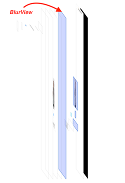

# UIView-Blur
Dynamic blur for UIView using UIVisualEffectView

1. Put a transparent UIView over the elements that you need to blur (button, text field, etc.) 

2. Then initialize blur view:

```swift
import UIKit

class ViewController: UIViewController {
    
    @IBOutlet weak var viewForBlur: UIView!
    
    override func viewDidLoad() {
        super.viewDidLoad()
        self.viewForBlur.isUserInteractionEnabled = false;
        _ = self.viewForBlur.blurView.setup(style: .light, intensity: 0);
    }
    
}
```

3. At any time you can change the blur intensity:

```swift
@IBAction func valueChanged(_ sender: Any) {
    self.viewForBlur.blurView.intensity = CGFloat((sender as! UISlider).value);
}
```
[Video Preview (Youtube)](https://www.youtube.com/watch?v=aFiccUux58M)
[](https://www.youtube.com/watch?v=aFiccUux58M)
